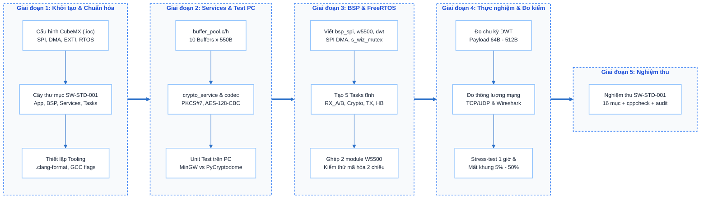
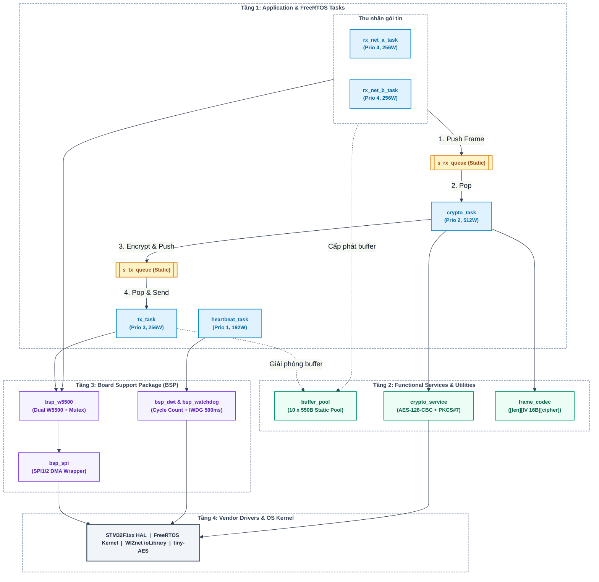

## 1. Sơ đồ khối Lộ trình triển khai (Project Workflow)

```mermaid
%%{init: {'theme': 'base', 'themeVariables': { 'primaryColor': '#EBF3FC', 'primaryBorderColor': '#2B70C9', 'primaryTextColor': '#1F2937', 'lineColor': '#2B70C9', 'secondaryColor': '#F3F4F6', 'tertiaryColor': '#FFFFFF'}}}%%
flowchart LR
    classDef stepNode fill:#FFFFFF,stroke:#93C5FD,stroke-width:1.5px,color:#1E293B,font-size:12px;
    classDef stageGroup fill:#F8FAFC,stroke:#3B82F6,stroke-width:1.5px,stroke-dasharray: 4 3,color:#1D4ED8,font-weight:bold,font-size:13px;

    subgraph G1["Giai đoạn 1: Khởi tạo & Chuẩn hóa"]
        A1["Cấu hình CubeMX (.ioc)<br/>SPI, DMA, EXTI, RTOS"] --> A2["Cây thư mục SW-STD-001<br/>App, BSP, Services, Tasks"]
        A2 --> A3["Thiết lập Tooling<br/>.clang-format, GCC flags"]
    end

    subgraph G2["Giai đoạn 2: Services & Test PC"]
        B1["buffer_pool.c/h<br/>10 Buffers x 550B"] --> B2["crypto_service & codec<br/>PKCS#7, AES-128-CBC"]
        B2 --> B3["Unit Test trên PC<br/>MinGW vs PyCryptodome"]
    end

    subgraph G3["Giai đoạn 3: BSP & FreeRTOS"]
        C1["Viết bsp_spi, w5500, dwt<br/>SPI DMA, s_wiz_mutex"] --> C2["Tạo 5 Tasks tĩnh<br/>RX_A/B, Crypto, TX, HB"]
        C2 --> C3["Ghép 2 module W5500<br/>Kiểm thử mã hóa 2 chiều"]
    end

    subgraph G4["Giai đoạn 4: Thực nghiệm & Đo kiểm"]
        D1["Đo chu kỳ DWT<br/>Payload 64B - 512B"] --> D2["Đo thông lượng mạng<br/>TCP/UDP & Wireshark"]
        D2 --> D3["Stress-test 1 giờ &<br/>Mất khung 5% - 50%"]
    end

    subgraph G5["Giai đoạn 5: Nghiệm thu"]
        E1["Nghiệm thu SW-STD-001<br/>16 mục + cppcheck + audit"]
    end

    G1 ==> G2 ==> G3 ==> G4 ==> G5

    class A1,A2,A3,B1,B2,B3,C1,C2,C3,D1,D2,D3,E1 stepNode;
    class G1,G2,G3,G4,G5 stageGroup;
```

---

## 2. Sơ đồ khối Kiến trúc phân lớp & Luồng dữ liệu (System Architecture)

```mermaid
%%{init: {'theme': 'base', 'themeVariables': { 'primaryColor': '#F1F5F9', 'primaryBorderColor': '#64748B', 'primaryTextColor': '#0F172A', 'lineColor': '#334155', 'tertiaryColor': '#FFFFFF'}}}%%
flowchart TB
    classDef taskNode fill:#E0F2FE,stroke:#0284C7,stroke-width:1.5px,color:#0369A1,font-weight:600,font-size:12px;
    classDef queueNode fill:#FEF3C7,stroke:#D97706,stroke-width:1.5px,color:#92400E,font-weight:600,font-size:12px;
    classDef srvNode fill:#ECFDF5,stroke:#059669,stroke-width:1.5px,color:#065F46,font-weight:600,font-size:12px;
    classDef bspNode fill:#F5F3FF,stroke:#7C3AED,stroke-width:1.5px,color:#5B21B6,font-weight:600,font-size:12px;
    classDef halNode fill:#F1F5F9,stroke:#475569,stroke-width:2px,color:#1E293B,font-weight:bold,font-size:12px;
    classDef groupTitle fill:#FFFFFF,stroke:#94A3B8,stroke-width:1.5px,stroke-dasharray: 4 2,color:#334155,font-weight:bold,font-size:13px;

    subgraph L1["Tầng 1: Application & FreeRTOS Tasks"]
        direction TB
        subgraph INGRESS["Thu nhận gói tin"]
            RXA["rx_net_a_task<br/>(Prio 4, 256W)"]
            RXB["rx_net_b_task<br/>(Prio 4, 256W)"]
        end
        Q_RX[["s_rx_queue (Static)"]]
        CRYPTO["crypto_task<br/>(Prio 2, 512W)"]
        Q_TX[["s_tx_queue (Static)"]]
        TX["tx_task<br/>(Prio 3, 256W)"]
        HB["heartbeat_task<br/>(Prio 1, 192W)"]
    end

    subgraph L2["Tầng 2: Functional Services & Utilities"]
        POOL["buffer_pool<br/>(10 x 550B Static Pool)"]
        CS["crypto_service<br/>(AES-128-CBC + PKCS#7)"]
        CODEC["frame_codec<br/>([len][IV 16B][cipher])"]
    end

    subgraph L3["Tầng 3: Board Support Package (BSP)"]
        WIZ["bsp_w5500<br/>(Dual W5500 + Mutex)"]
        SPI["bsp_spi<br/>(SPI1/2 DMA Wrapper)"]
        DIAG["bsp_dwt & bsp_watchdog<br/>(Cycle Count + IWDG 500ms)"]
    end

    subgraph L4["Tầng 4: Vendor Drivers & OS Kernel"]
        HAL["STM32F1xx HAL  |  FreeRTOS Kernel  |  WIZnet ioLibrary  |  tiny-AES"]
    end

    %% Luồng xử lý dữ liệu chính (Main Pipeline)
    INGRESS -->|"1. Push Frame"| Q_RX
    Q_RX -->|"2. Pop"| CRYPTO
    CRYPTO -->|"3. Encrypt & Push"| Q_TX
    Q_TX -->|"4. Pop & Send"| TX

    %% Gọi tầng Services
    CRYPTO --> CS
    CRYPTO --> CODEC
    INGRESS -.->|"Cấp phát buffer"| POOL
    TX -.->|"Giải phóng buffer"| POOL

    %% Giao tiếp ngoại vi (BSP & Hardware)
    INGRESS & TX --> WIZ
    HB --> DIAG
    WIZ --> SPI
    SPI & DIAG & CS --> HAL

    class RXA,RXB,CRYPTO,TX,HB taskNode;
    class Q_RX,Q_TX queueNode;
    class POOL,CS,CODEC srvNode;
    class WIZ,SPI,DIAG bspNode;
    class HAL halNode;
    class L1,L2,L3,L4,INGRESS groupTitle;
```
